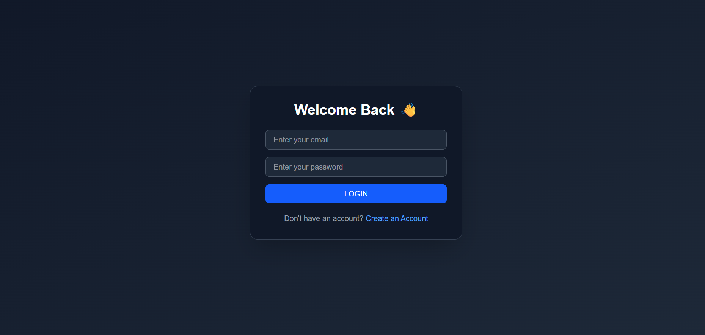
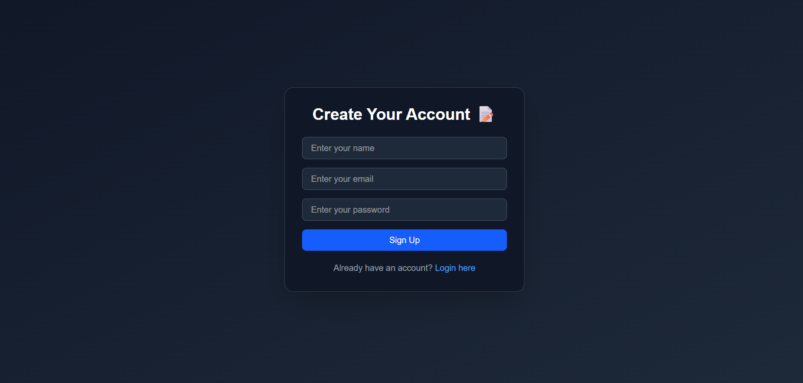
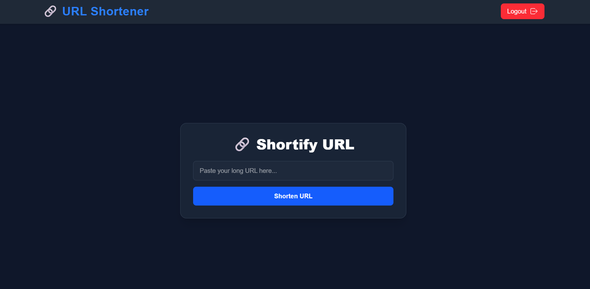

# 🔗 URL Shortener Web App

A modern, full-stack URL shortener built using the MERN stack with Tailwind CSS and Framer Motion for smooth animations and a sleek UI. Users can register, log in, and shorten long URLs into clean, shareable links with click tracking support.

---

## 🚀 Features

- 🔐 User Authentication (Signup & Login)  
- 🔗 Generate Short URLs from long links  
- 📊 Click Tracking (optional)  
- 🧠 Auth context with JWT tokens  
- 🌐 Responsive UI with Tailwind CSS  
- 🎞 Smooth animations using Framer Motion  

---

## 🛠 Tech Stack

### Frontend
- **React.js**  
- **Tailwind CSS**  
- **Framer Motion**  
- **React Router DOM**  
- **Axios**  

### Backend
- **Node.js**  
- **Express.js**  
- **MongoDB** with **Mongoose**  
- **Bcrypt.js** (for password hashing)  
- **JWT** (for authentication)  

---


---

## 📸 Screenshots

### Signup Page  


### 🔐 Login Page  


### 🏠 Home / Dashboard  


---

---

## ⚙️ Setup Instructions

### 📌 Prerequisites
- Node.js and npm installed
- MongoDB (Atlas or local instance)

---


### 🔧 Backend Setup

1. Navigate to the backend folder:
   ```bash
   cd backend
Install dependencies:

npm install
Create a .env file inside /backend with the following variables:


PORT=3000
 MONGODB_URI=your_mongodb_connection_string
 JWT_SECRET=your_secret_key
 Start the backend server:


 npm start
🎨 Frontend Setup
 Navigate to the frontend folder:


 cd frontend


 Install dependencies:


 npm install
 Start the frontend development server:

 npm run dev
 🔐 Authentication Flow
User signs up → Token is generated and stored in localStorage

Auth context manages login state globally

 Authenticated users can access the dashboard and shorten URLs

 Token is automatically sent with each API request for authentication


 
### API Endpoints (Backend)

| Method | Endpoint         | Description           |
|--------|------------------|-----------------------|
| POST   | `/auth/signup`   | Register new user      |
| POST   | `/auth/login`    | Authenticate user     |
| POST   | `/url/shorten`   | Create a short URL    |
| GET    | `/url/:shortId`  | Redirect to long URL  |


👤 Author
Bharat Khatwani

B.Tech CSE (AI Branch) student

Passionate about Full-Stack development and AI


Email: bharatkhatwani06@gmail.com


